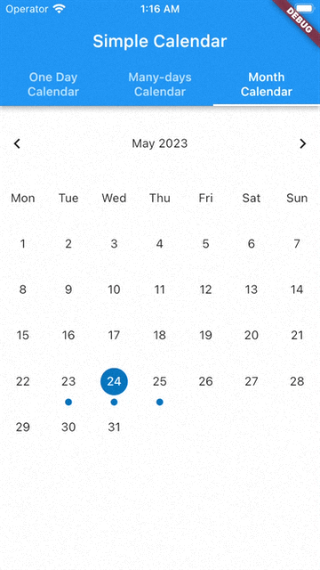
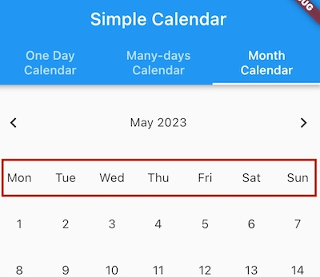

<!-- 
This README describes the package. If you publish this package to pub.dev,
this README's contents appear on the landing page for your package.

For information about how to write a good package README, see the guide for
[writing package pages](https://dart.dev/guides/libraries/writing-package-pages). 

For general information about developing packages, see the Dart guide for
[creating packages](https://dart.dev/guides/libraries/create-library-packages)
and the Flutter guide for
[developing packages and plugins](https://flutter.dev/developing-packages). 
-->

Simple Calendar allows you to show events on a calendar.




# Features

It contains 3 types of calendar views:
* monthly
* with custom number of days(can be used for a whole week)
* daily

You can customize calendar's colors, fonts, size, etc. by passing CalendarSettings object to Calendar widget.

Simple Calendar uses [BloC package](https://github.com/felangel/bloc) to manage its state.

# Getting started

You should implement `CalendarEventsRepository` interface to provide events for calendar. You can provide caching system there, etc. 

Here's the simplest implementation of `CalendarEventsRepository` that you can find in `example/lib/repositiories`:

```dart
class MockCalendarEventsRepository extends CalendarEventsRepository {
  MockCalendarEventsRepository(this._service);

  final MockEventsService _service;

  @override
  Future<List<SingleCalendarEvent>> getEventsForDay(DateTime date) async {
    final events = await _service.getEventsForDay(date);

    return _mapEvents(events);
  }

  @override
  Future<List<SingleCalendarEvent>> getEventsForMultipleDays(
      DateTime fromDate, DateTime toDate) async {
    final fixedFromDate = fromDate.dateOnly();
    final fixedToDate = toDate.dateOnly();

    final events =
        await _service.getEventsForMultipleDays(fixedFromDate, fixedToDate);

    return _mapEvents(events);
  }
}
```
#
Then you should create `CalendarEventsRepository` and pass it to the choosen calendar view widget:

```dart
 @override
  Widget build(BuildContext context) {
    return  OneDayCalendarView(
          scrollController: scrollController,
          calendarEventsRepository: context.read<CalendarEventsRepository>(),
          // ...
    );
  }
```
#

To each calendar view widget you can pass `CalendarSettings`. You can customize calendar's colors, fonts, size, etc. by passing CalendarSettings object to Calendar widget. If you don't pass `CalendarSettings` to the widget, it will use default settings.

You can store `CalendarSettings` somewhere and provide it to the calendar view widget, for example via `Provider`. If you need some modifications to the settings that you already have, you can use `copyWith` method to create a new `CalendarSettings` object with your modifications.

 Here's an example of `CalendarSettings`:


```dart
@override
  Widget build(BuildContext context) {
   return OneDayCalendarView(
          scrollController: scrollController,
          calendarEventsRepository: context.read<CalendarEventsRepository>(),
          calendarSettings: CalendarSettings(
            startHour: 0,
            endHour: 24,
            oneDayHeaderTextStyle: /* Custom TextStyle */,
            fiveDaysHeaderTextStyle: /* Custom TextStyle */,
            calendarCurrentMonthTileStyle: /* Custom TextStyle */,
            calendarNotCurrentMonthTileStyle: /* Custom TextStyle */,
            calendarHeaderStyle: /* Custom TextStyle */,
            calendarDotColor: /* Custom Color */,
            firstLineTileTextStyle: /* Custom TextStyle */,
            iconBackgroundOpacity: 0.2,
            iconSpacingFromText: 8.0,
            secondLineTileTextStyle: /* Custom TextStyle */,
            tileIconSize: 24,
            calendarMonthDayStyle: /* Custom TextStyle */,
          ),
          // handlers for events
          onEventTap: (_) {},
          onLongPress: (_) {},
          onSelected: (_) {},
    );
  }
```

# Translations
Each calendar view widget has optional `locale` parameter that you can use to translate calendar's months and days names. If you don't pass `locale` parameter to the widget, it will use system locale.

```dart
  @override
    Widget build(BuildContext context) {
      return OneDayCalendarView(
            locale: Localizations.localeOf(context),
            // ...
      );
    }
```

If you want to pass some locale, but you are not using any localization delegates in `MaterialApp` widget you should call `initializeDateFormatting` method in your bootstrapping function to initialize date formatting via `intl` package.

```dart
import 'package:intl/date_symbol_data_local.dart';

void main() async {
  await initializeDateFormatting();

  runApp(MyApp());
}
```

## Custom weekdays abbreviations



If you want to customize weekdays abbreviations that are shown on monthly calendar view, you can pass `customWeekdayAbbreviation` function to the widget.

That function has a structure like this:
```dart
String? Function(BuildContext, int)? customWeekdayAbbreviation;
```


 If you don't pass `daysAbbreviations` parameter to the widget, it will use default abbreviations for the locale provided via `locale` parameter or system's locale.

```dart
  @override
    Widget build(BuildContext context) {
      return OneDayCalendarView(
          customWeekdayAbbreviation: (context, dayNumber) {
            /// You can get current locale from context and return custom translated abbreviations
            final locale = Localizations.localeOf(context);

            switch (dayNumber) {
              case DateTime.monday:
                return 'Mon';
              case DateTime.tuesday:
                return 'Tue';
              case DateTime.wednesday:
                return 'Wed';
              case DateTime.thursday:
                return 'Thu';
              case DateTime.friday:
                return 'Fri';
              case DateTime.saturday:
                return 'Sat';
              case DateTime.sunday:
                return 'Sun';
              default:
                return null;
            } 
          },
      );
    }
```
